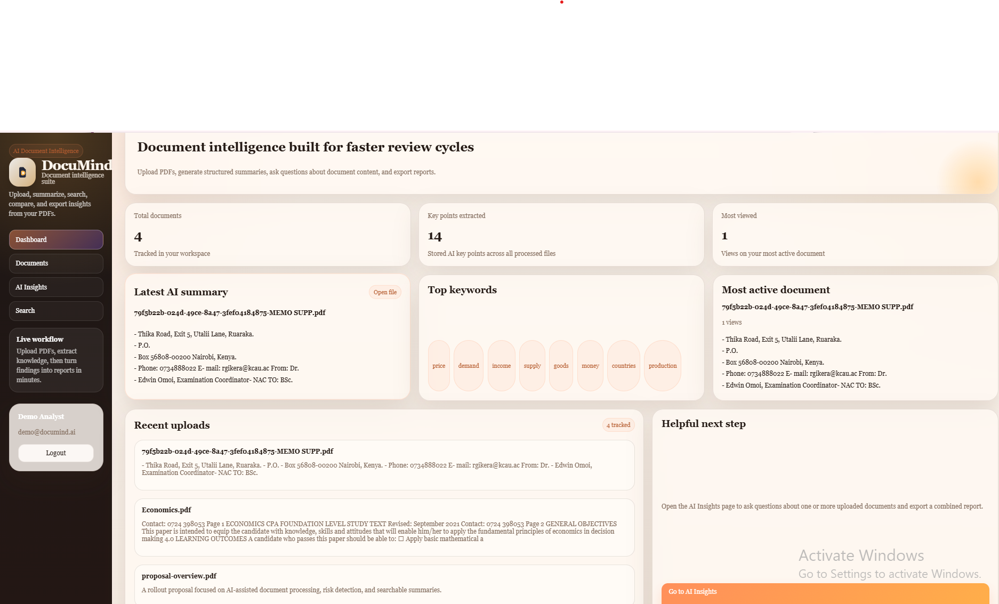
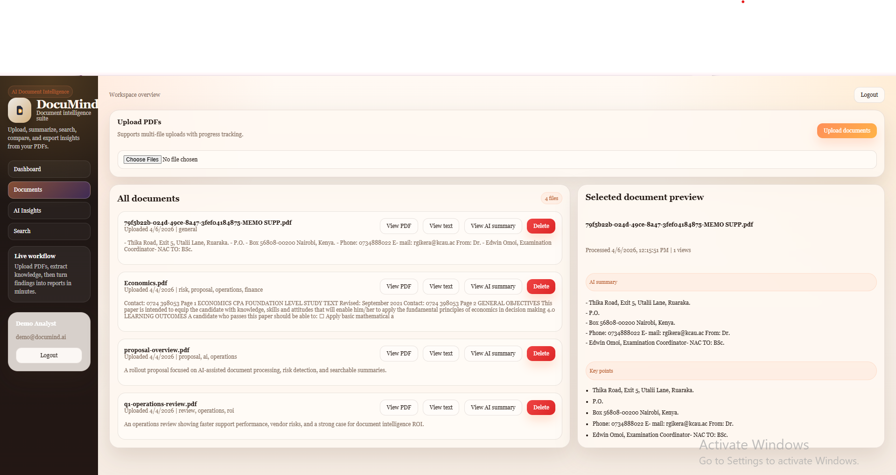
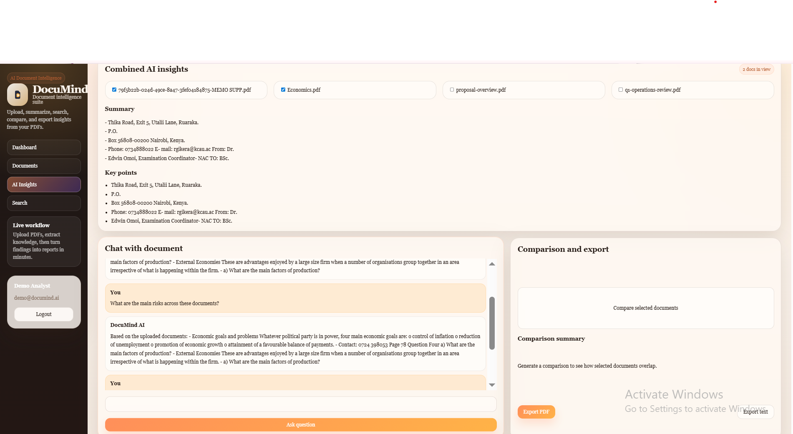
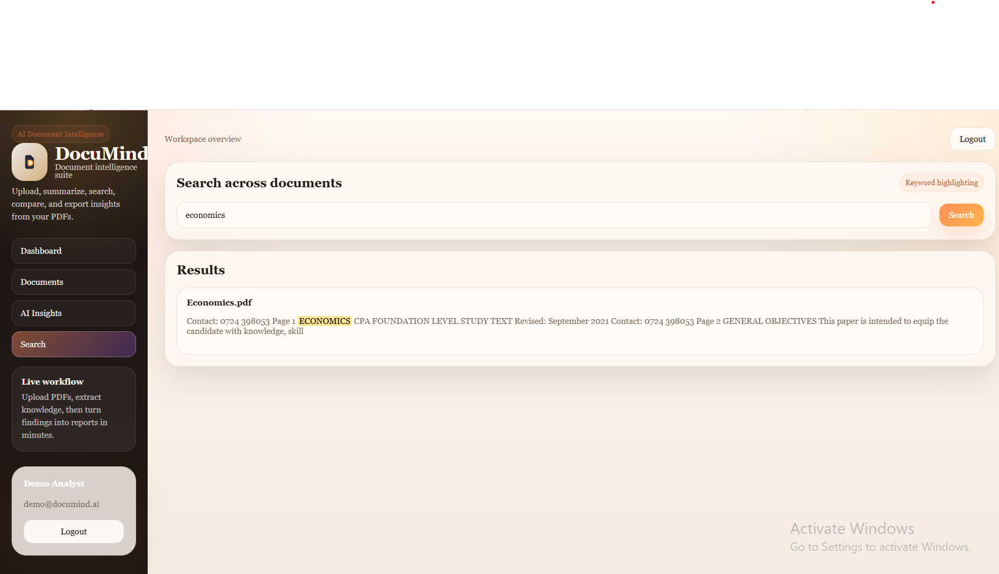

# DocuMind

<p align="left">
  
  
  
  
  
  
  
</p>

DocuMind is an AI-powered document intelligence platform that helps users upload PDF documents, extract text, generate summaries, identify key insights, search across files, and chat with document content from a modern SaaS-style dashboard.

Built to feel like a real production-ready product, DocuMind combines document management, AI-assisted analysis, and report generation into one workflow.

## Author

Mwihaki Muigai

## Features

- JWT authentication with register, login, and logout
- Multi-document PDF upload
- PDF text extraction with `pdf-parse`
- AI-powered document summaries and key points
- Combined insights across multiple documents
- Chat with document content
- Search across uploaded documents
- Dashboard with latest AI summary, top keywords, and active documents
- Detailed document view page
- Export reports as PDF or text
- Modern responsive SaaS UI

## Tech Stack

### Frontend
- Next.js
- React
- TypeScript

### Backend
- Node.js
- Express
- TypeScript

### AI / Processing
- OpenAI API
- `pdf-parse`

### Storage
- MySQL-ready configuration
- Local demo JSON persistence for development fallback

## Screenshots

### Login Page


### Dashboard

### Documents Page

### AI Insights Page

### Search Page


## Project Structure

```bash
DocuMind/
├── backend/
│   ├── src/
│   │   ├── config/
│   │   ├── controllers/
│   │   ├── middleware/
│   │   ├── models/
│   │   ├── routes/
│   │   ├── services/
│   │   ├── utils/
│   │   └── data/
│   └── uploads/
├── frontend/
│   ├── app/
│   ├── components/
│   ├── lib/
│   └── public/
├── docs/
└── README.md
```

## Core Modules

### Authentication
Users can register, log in, and log out securely using JWT-based authentication.

### Document Processing
Uploaded PDFs are parsed, text is extracted, and each document is processed into:
- summary
- key points
- important sections
- searchable extracted text

### AI Insights
Users can:
- generate combined summaries
- compare selected documents
- ask questions about uploaded files through chat

### Dashboard
The dashboard displays:
- total document count
- latest AI summary
- top extracted keywords
- most active document
- recent uploads

## How It Works

1. User logs into the platform
2. User uploads one or more PDF documents
3. Backend extracts text from the PDF
4. AI generates summary and key insights
5. Processed results are stored and displayed in the dashboard
6. User can search, open document details, chat with content, or export reports

## Installation

### 1. Clone the project
```bash
git clone <your-repo-url>
cd DocuMind
```

### 2. Install dependencies
```bash
npm install
```

### 3. Configure environment variables
Create a `.env` file in the project root:

```env
MYSQL_HOST=localhost
MYSQL_PORT=3306
MYSQL_USER=root
MYSQL_PASSWORD=password
MYSQL_DATABASE=documind
JWT_SECRET=replace-with-a-strong-secret
OPENAI_API_KEY=your_openai_key_here
USE_MOCK_DB=true
NEXT_PUBLIC_API_URL=http://localhost:5000/api
```

### 4. Run the backend
```bash
npm run dev:backend
```

### 5. Run the frontend
```bash
npm run dev:frontend
```

## App URLs

- Frontend: [http://localhost:3000](http://localhost:3000)
- Backend health endpoint: [http://localhost:5000/api/health](http://localhost:5000/api/health)

## Demo Credentials

```txt
Email: demo@documind.ai
Password: Password123!
```

## Notable Improvements

- Better upload reliability
- Clearer error handling
- Graceful fallback when AI quota is unavailable
- Improved document detail flow
- Session-based chat history
- Better dashboard content with meaningful data
- Cleaner summaries for readability

## Future Enhancements

- OCR support for scanned PDFs
- MySQL full production persistence layer
- Role-based access control
- Team collaboration and shared workspaces
- Analytics for document usage trends

## Why This Project Stands Out

DocuMind is more than a simple file upload app. It demonstrates how AI can be integrated into document workflows to:
- reduce reading time
- improve information retrieval
- generate useful insights from long-form content
- create a practical business-oriented SaaS experience

## License

This project is for educational, portfolio, and demonstration purposes.

## Acknowledgements

- OpenAI
- Next.js
- Express
- pdf-parse
